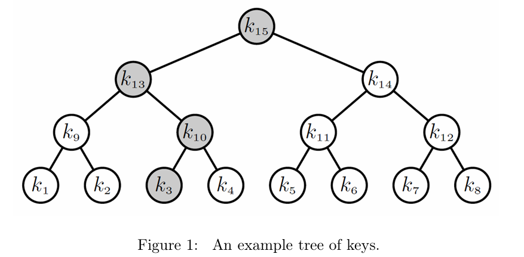
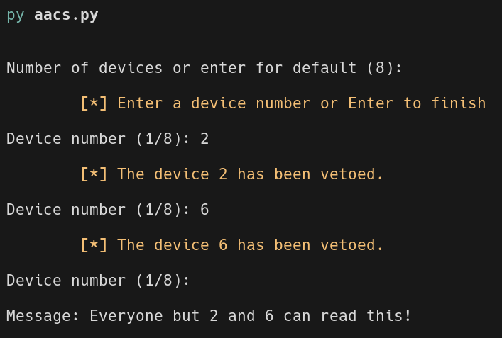
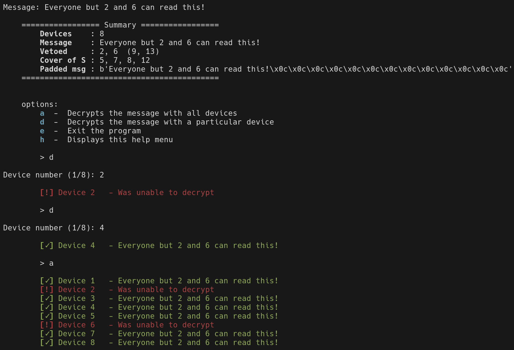

# Advanced Access Content System


- Made by **Rubén Diz Martínez**

## :scroll: Description

A proof-of-concept implementation of a broadcast encryption system with device revocation, modeled after the Advanced Access Content System (AACS) used for encrypting content on DVDs and Blu-ray discs. This project simulates a network of media devices organized in a binary tree of keys, enabling the secure distribution of encrypted content while selectively revoking access for compromised nodes.



Key Features:

- Tree-Based Broadcast Encryption: Organizes device keys into a hierarchical binary tree, where each authorized device holds a specific subset of keys corresponding to the path from its assigned leaf to the root node.
- Selective Device Revocation: Allows the system to revoke access for any subset of compromised devices by calculating a minimal "cover set" of sibling nodes. This ensures that unauthorized devices cannot decrypt new content headers.
- Robust Cryptography: Employs AES-128 in counter or CBC mode to securely encrypt both the random media keys and the underlying payload, such as images or short movies.
- Dynamic Access Control: Guarantees that even if a device is compromised and its keys are published to the world, future content remains secure and fully accessible to all uncompromised devices in the network.

## :file_folder: Folder Structure

```text
.
├── README.md
├── LICENSE
├── requirements.txt
└── src
    ├── aacs.py
    ├── colors.py
    ├── config.py
    ├── crypto.py
    ├── print.py
    └── tree.py
```

## :clipboard: Prerequisites

- Python 3.11+

## :wrench: Installation

1. Move to src and create a virtual environment.

```sh
cd src
python -m venv venv
```

2. Next run:

```sh
# Linux/MacOS
source venv/bin/activate 
```

```powershell
# Windows
venv\Scripts\activate
```

> [!WARNING]
> In case we get a **UnauthorizedAccess** error in Windows, we can enter:
> `Set-ExecutionPolicy -ExecutionPolicy RemoteSigned -Scope CurrentUser`

3. Then install the requirements.

```sh
pip install -r ../requirements.txt
```

## :computer: Usage

Using python the code can be executed:

```sh
python aacs.py
```

### Examples

Here is a complete walkthrough of the interactive AACS simulation. In this scenario, we set up a network of 8 devices, revoke access for two specific devices and then test the decryption capabilities of the network.

First, launch the script to begin the interactive setup. You will be prompted to define the total number of devices, select which ones to revoke (or veto) and input the secret message to encrypt.



After providing the message, the program calculates the optimal "Cover of S", the minimal set of keys needed to encrypt the payload for the remaining authorized devices. Using the interactive menu, you can test decryption node by node. As shown below, the revoked devices (2 and 6) are completely locked out, while all other devices successfully recover the text.



## :page_facing_up: License

This project is licensed under the [MIT License](LICENSE).

## :incoming_envelope: Contact me

<p>
  <a href="mailto:ruben.diz@udc.es?subject=[GitHub]%20Toma%20de%20contacto&body=Hola%20Rub%C3%A9n%2C%0A%0AMe%20dirijo%20a%20ti%20hoy%20despu%C3%A9s%20de%20ver%20tu%20perfil%20de%20GitHub%20para%20..."></a>
  <a href="https://www.linkedin.com/in/rub%C3%A9n-diz-mart%C3%ADnez-ab1a17254"></a>
  <a href="https://github.com/Rubi960"></a>
</p>
